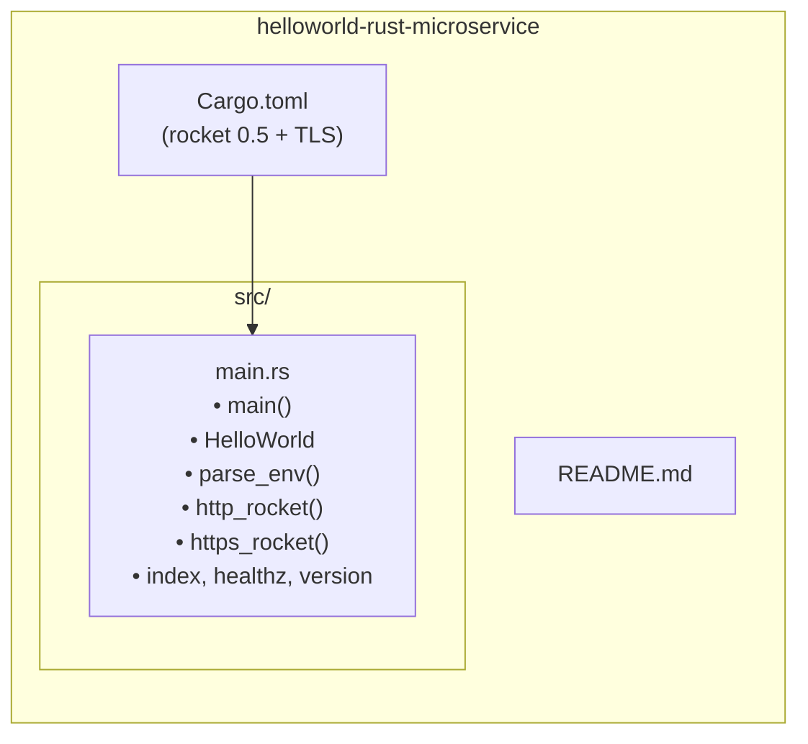
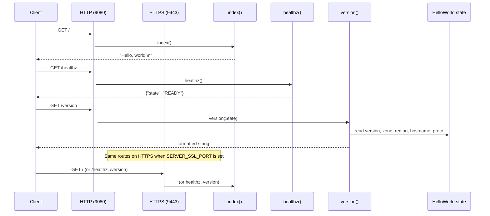

# Hello World Rust Microservice — Architecture

## Codebase diagram

```mermaid
flowchart TB
    subgraph entry["Entry point"]
        main["main()"]
    end

    subgraph env["Environment"]
        SERVER_SSL_PORT
        SERVER_PORT
        SERVICE_VERSION
        ZONE
        REGION
        HOSTNAME
        SSL_KEY
        SSL_CERT
    end

    subgraph helpers["Helpers"]
        parse_env["parse_env<T>()"]
    end

    subgraph state["Shared state"]
        HelloWorld["HelloWorld\n(version, zone, region,\nhostname, proto)"]
    end

    subgraph rockets["Rocket servers"]
        http_rocket["http_rocket()\nport: SERVER_PORT (default 9080)"]
        https_rocket["https_rocket()\nport: SERVER_SSL_PORT (default 9443)"]
    end

    subgraph routes["Routes (mounted on both servers)"]
        index["GET / → index()\n\"Hello, world!\""]
        healthz["GET /healthz → healthz()\n{\"state\": \"READY\"}"]
        version["GET /version → version()\nversion, zone, region, instance, proto"]
    end

    subgraph deps["Dependencies"]
        rocket["Rocket 0.5 (with TLS)"]
    end

    main --> SERVER_SSL_PORT
    SERVER_SSL_PORT -->|set| main
    main -->|"HTTP only"| http_rocket
    main -->|"HTTP + HTTPS"| http_rocket
    main -->|"HTTP + HTTPS"| https_rocket

    http_rocket --> parse_env
    https_rocket --> parse_env
    parse_env --> env

    http_rocket --> HelloWorld
    https_rocket --> HelloWorld
    http_rocket --> index
    http_rocket --> healthz
    http_rocket --> version
    https_rocket --> index
    https_rocket --> healthz
    https_rocket --> version

    version --> HelloWorld
    rockets --> rocket
```

## File layout



## Request flow



## Components

| Component | Location | Role |
|----------|----------|------|
| **main()** | `src/main.rs` | Starts HTTP only, or HTTP + HTTPS if `SERVER_SSL_PORT` is set |
| **HelloWorld** | `src/main.rs` | In-memory state (version, zone, region, hostname, proto) from env |
| **parse_env()** | `src/main.rs` | Reads and parses optional env vars with defaults |
| **http_rocket()** | `src/main.rs` | Builds Rocket HTTP server, mounts routes, manages `HelloWorld` |
| **https_rocket()** | `src/main.rs` | Builds Rocket TLS server (needs `SSL_KEY`, `SSL_CERT`), same routes |
| **index** | `src/main.rs` | `GET /` → `"Hello, world!\n"` |
| **healthz** | `src/main.rs` | `GET /healthz` → `{"state": "READY"}` |
| **version** | `src/main.rs` | `GET /version` → version/zone/region/instance/proto from state |
